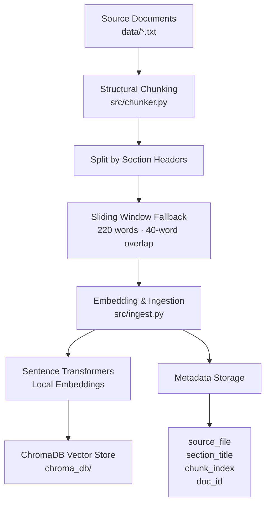
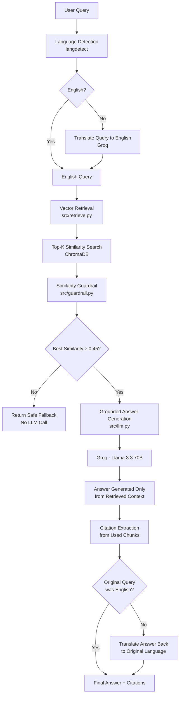

# Document Q&A with Citations — Potens AI/ML Take-Home (Q1)

A RAG system over 5 documents on AI governance/policy (EU AI Act, NIST AI RMF, an internal-style company AI usage policy, and two deliberately opposing essays on open-weight model release). Returns cited answers, refuses to answer when the docs don't cover a question, detects cross-document contradictions, and supports queries in many languages via a translation boundary.

## Why this document set
I picked AI governance/policy text because it's substantive, has real internal structure (sections), and deliberately includes two documents (`doc4` and `doc5`) that directly disagree on whether safety fine-tuning is
cheap or expensive to remove from an open-weight model. That gives the `/contradict` endpoint something real to find, rather than a synthetic case.

## Architecture

The system follows a Retrieval-Augmented Generation (RAG) architecture with multilingual query handling, similarity-based guardrails, grounded answer generation, and source citations.

### 1. Document Ingestion Pipeline



Documents are split structurally using section headers. Long sections use a sliding-window chunking strategy with **220-word chunks** and a **40-word overlap**. Each chunk is embedded locally using Sentence Transformers and stored in ChromaDB along with source metadata.

---

### 2. Query and Answer Pipeline



`/contradict` skips retrieval-by-similarity and instead pulls **all** chunks belonging to the two specified `doc_id`s, then asks the LLM to compare them on a given topic and explain its reasoning.

## Chunking strategy
I chunk **structurally, not by fixed character count**. Each source document uses `## Section Title` markdown headers, so I split on those first — this keeps each chunk a coherent unit of meaning instead of cutting a sentence in half at an arbitrary character boundary, which would make citations misleading. If a section is still long, I apply a sliding window (220 words, 40-word overlap) so no single chunk is too large for the embedding model's effective context, while the overlap prevents losing meaning at the boundary. Every chunk carries `source_file`, `section_title`, and `chunk_index` metadata — this is what lets `/ask` return a real citation
(file + section + snippet) instead of just a raw answer.

## No-hallucination approach
Two layers:
1. **Similarity threshold gate** (`src/guardrail.py`) — if the top retrieved chunk's similarity score is below 0.45, we don't even call the LLM. This is deterministic and cheap, and covers the case of a query that's completely unrelated to the corpus.
2. **Strict system prompt** (`src/llm.py`) — the LLM is instructed to answer only from the provided chunks and to say explicitly when it can't, for the case where retrieval returns *marginally* related chunks that don't actually contain the answer. The LLM returns structured JSON with a `covered: true/false` field so the app can react to this reliably instead of parsing free text.

## Setup

```bash
python -m venv venv
venv\Scripts\activate
pip install -r requirements.txt

cp .env
# edit .env and paste your free Groq API key (console.groq.com)

# build the vector index (run once, or whenever data changes)
python -m src.ingest

# start the API
uvicorn src.main:app --reload --port 8000

# in a second terminal, start the UI
streamlit run app.py
```

Try it at `http://localhost:8501` (Streamlit) or hit the API directly:

```bash
curl -X POST http://localhost:8000/ask \
  -H "Content-Type: application/json" \
  -d '{"query": "What are the four risk tiers in the EU AI Act?"}'

curl -X POST http://localhost:8000/contradict \
  -H "Content-Type: application/json" \
  -d '{"doc_id_1": "doc4_openweight_case_for", "doc_id_2": "doc5_openweight_case_against", "topic": "cost of removing safety fine-tuning"}'
```

See `examples/sample_queries.md` for a full test list, including queries designed to trigger the hallucination guardrail and multilingual examples.

## What's broken / unfinished
- Similarity score is a rough L2-distance-to-similarity conversion, not a calibrated confidence score — good enough for a threshold gate, not precise enough to surface as a trustworthy percentage to the user.
- `/contradict` pulls *all* chunks for a doc rather than only chunks relevant to the given topic — fine at this corpus size (5 docs), would need topic-filtered retrieval first at a larger scale. 
- No reranker — retrieval is pure cosine similarity over MiniLM embeddings. A cross-encoder reranker would improve precision on ambiguous queries. 
- No eval set with ground-truth retrieval@k scoring — I prioritized getting all required functionality solid over the stretch goals given the time budget.
- Language detection (`langdetect`) can misfire on very short queries (under ~4 words) — a longer query is more reliable.

## What I'd build next
- A confidence score surfaced in the UI, calibrated against a small labeled set of "should answer" vs "should refuse" queries.
- A cross-encoder reranker (e.g. `ms-marco-MiniLM`) on the top-10 before picking the final top-k for the LLM.
- Topic-filtered retrieval inside `/contradict` so it scales past a handful of documents per doc_id.
- Streaming responses in the Streamlit UI instead of a blocking spinner.

## AI Use Log

Used Claude for the initial code scaffold, API endpoints, testing, parts of the translation layer, minor UI work, and project documentation. I then reviewed, rebuilt, tested, and verified each piece to understand the implementation — including debugging a Groq/httpx version conflict and a PowerShell UTF-8 console rendering issue during multilingual testing.